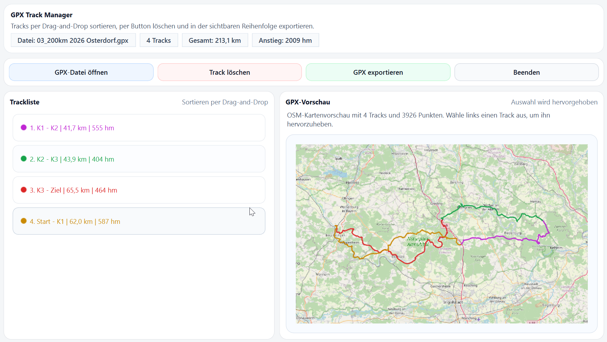

# GPX Track Merger

Desktop-Anwendung zum Sortieren, Prüfen und Zusammenführen von GPX-Tracks unter Windows. Die Anwendung bietet eine helle PyQt6-Oberfläche, eine statische OSM-Vorschau, eindeutige Track-Farben und Export in der sichtbaren Listenreihenfolge.

## Download

[Aktuelle EXE herunterladen (v1.0.3)](https://github.com/danielrausch82/GPX-Track-Merger/releases/download/v1.0.3/GPX-Track-Merger-1.0.3.exe)

[Alle Releases ansehen](https://github.com/danielrausch82/GPX-Track-Merger/releases)

## Changelog

[Änderungen zwischen den Versionen ansehen (CHANGELOG.md)](CHANGELOG.md)

## Screenshot



## Funktionen

- GPX-Dateien importieren und enthaltene Tracks direkt in einer Liste anzeigen.
- Tracks per Drag-and-Drop sortieren.
- Einzelne Tracks gezielt löschen.
- OSM-Vorschau mit allen Tracks und Hervorhebung der Auswahl anzeigen.
- Track-Farben aus der GPX-Datei übernehmen und bei Farbdopplungen automatisch auf eindeutige Alternativen ausweichen.
- Gesamtkilometer und Höhenmeter sowie Werte je Track anzeigen.
- Alle verbleibenden Tracks in der sichtbaren Reihenfolge zu einer neuen GPX-Datei exportieren.

## Systemanforderungen

- Windows 10 oder Windows 11
- Python 3.10 oder neuer empfohlen
- PyQt6
- gpxpy

## Installation für Entwicklung

1. Virtuelle Umgebung anlegen und aktivieren.
2. Abhängigkeiten installieren.

```powershell
python -m venv .venv
.\.venv\Scripts\Activate.ps1
pip install -r requirements.txt
```

## Anwendung starten

```powershell
.\.venv\Scripts\python.exe .\main.py
```

## Bedienung

1. GPX-Datei öffnen.
2. Tracks in der linken Liste per Drag-and-Drop sortieren.
3. Optional einen Track auswählen, um ihn auf der Karte hervorzuheben.
4. Nicht benötigte Tracks über Track löschen entfernen.
5. Die verbleibenden Tracks über GPX exportieren als zusammengeführten Track speichern.

## EXE-Build

Für einen lokalen Release-Build unter Windows kann PyInstaller verwendet werden:

```powershell
.\.venv\Scripts\Activate.ps1
pip install -r requirements.txt
pyinstaller --noconfirm --clean .\GPX-Track-Merger-1.0.3.spec
```

Die fertige Datei liegt danach unter dist\GPX-Track-Merger-1.0.3.exe.

## Hinweise

- Der Export fasst alle verbleibenden Tracks zu einem einzelnen GPX-Track zusammen.
- Die Exportreihenfolge entspricht immer der sichtbaren Reihenfolge in der Trackliste.
- Die Kartenansicht verwendet statische OSM-Kacheln und ist bewusst nicht interaktiv.

## Release 1.0.1

- Überarbeitetes helles UI mit kompakterem Layout.
- Integrierte OSM-Vorschau für importierte Tracks.
- Anzeige von Distanz und Höhenmetern pro Track und gesamt.
- Eindeutige Farblogik für Tracks bei importierten GPX-Farbdopplungen.
- Bereinigte Lösch- und Importdialoge.

## Troubleshooting

### Import schlägt fehl

Prüfen, ob die GPX-Datei gültig ist und ob PyQt6 sowie gpxpy installiert sind.

### Kein Modul gefunden

```powershell
pip install -r requirements.txt
```

### EXE-Build fehlt

```powershell
pip install -r requirements.txt
```
